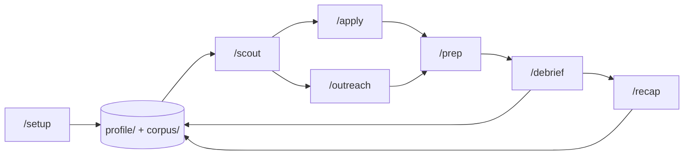

# jobhunt-os

A job-search workspace for Claude Code. I ran my own search on this system -- April to July 2026, roughly three months, eighteen processes end to end -- and it ended with an offer I took.

It's a head start, not a guarantee. The machinery is here; tuning it to your background, your market, and your location is the work.

MIT-licensed. Take what's useful.

## The loop



`/setup` seeds your profile and corpus once. `/scout` finds companies worth your time. `/apply` and `/outreach` act on them, `/prep` readies you for each conversation, and `/debrief` and `/recap` write what you learned back into the corpus -- so the next prep starts smarter than the last.

| Command | What it does |
|---------|--------------|
| [`/setup`](.claude/commands/setup.md) | One-time interview; generates your profile, corpus, and resume variants (replaces the Jordan Reyes examples) |
| [`/scout`](.claude/commands/scout.md) | Sources new opportunities from funding news + VC portfolios, scored against your fit profile |
| [`/apply`](.claude/commands/apply.md) | Tailors a resume variant to a job posting, builds the PDF, optionally drafts a cover letter, logs it to the tracker |
| [`/outreach`](.claude/commands/outreach.md) | LinkedIn-scoped notes: 300-char connection note, short DM, warm follow-up |
| [`/prep`](.claude/commands/prep.md) | Interview prep doc for a specific conversation: research + positioning + likely questions + landmines |
| [`/debrief`](.claude/commands/debrief.md) | Post-interview guided debrief; promotes reusable lessons to the corpus |
| [`/recap`](.claude/commands/recap.md) | Whole-arc retrospective when a process ends, closing the learning loop |

## Quickstart (5 minutes)

You need [Claude Code](https://claude.com/claude-code), plus two tools for the resume PDF pipeline (macOS one-liners shown; the build script prints Linux equivalents if either is missing):

```bash
brew install pandoc weasyprint
```

(On Linux, install both from your package manager; weasyprint needs its native pango/harfbuzz libraries, which pip alone does not provide.)

Clone the repo and start Claude Code inside it. The clone becomes your personal workspace -- don't push your filled-in version anywhere public.

```bash
git clone https://github.com/matthewod11-stack/jobhunt-os.git my-job-search
cd my-job-search
claude
```

Inside Claude Code:

1. `/setup` -- a one-time interview. Bring your resume(s) and a few career stories; it generates your profile, corpus, and resume variants, replacing the example content.
2. `/scout` -- your first sourcing run.

That's the whole install. Everything after that is a command you run when the moment calls for it.

## What's in the box

```
jobhunt-os/
|-- .claude/commands/   # the 7 commands
|-- profile/            # who you are: voice.md + fit-profile.json (generated by /setup)
|-- corpus/             # what you've learned: answer-bundles, cheat-sheet, question-trends
|-- templates/          # resume variant sources + build-resume.sh + print CSS
|-- applied/            # tailored resumes and cover letters, one set per company
|-- interview-prep/     # prep docs, debriefs, recaps, outreach notes
|-- docs/               # the sourcing playbook, the origin story, the VC registry
|-- tracker.csv         # the single log of every company, application, and touch
`-- CLAUDE.md           # loaded every session; tells Claude how the workspace works
```

The repo ships with a complete worked example by a fictional persona, Jordan Reyes. Poke around it before running `/setup` -- it shows what the system produces. The full Solara interview arc runs prep -> debrief -> recap ([solara-recruiter-prep.md](interview-prep/solara-recruiter-prep.md), [solara-post-call-1.md](interview-prep/solara-post-call-1.md), [solara-recap.md](interview-prep/solara-recap.md)), with the tailored [resume](applied/Jordan%20Reyes%20Solara%20Resume.pdf) and [cover letter](applied/Jordan%20Reyes%20Solara%20Cover%20Letter.pdf) it was built on, plus a cold-outreach example in [ferrous-outreach.md](interview-prep/ferrous-outreach.md). `/setup` replaces all of it with yours.

## The two big ideas

**Source companies, not job postings.** By the time a role hits a job board it has a recruiter, a pipeline, and hundreds of applicants. Funding creates hiring, and hiring precedes posting -- so `/scout` reads funding news and walks VC portfolios ([docs/vc-registry.md](docs/vc-registry.md)) to find companies before the posting exists, and treats a high-fit company with no open role as a lead for `/outreach`, not a dead end. The full reasoning, including the scoring rubric and the no-open-role arithmetic, is in [docs/SOURCING-PLAYBOOK.md](docs/SOURCING-PLAYBOOK.md).

**The corpus compounds.** Every debrief promotes reusable lessons into the corpus, and every future prep reads the corpus first -- so a question that wrecked you in one process has a worked answer waiting in the next. The loop is visible in the example content: a story-telling fix spotted in [solara-post-call-1.md](interview-prep/solara-post-call-1.md) lands in the "Promoted from debriefs" section of [corpus/cheat-sheet.md](corpus/cheat-sheet.md), where every later `/prep` will find it. This is why the system gets better the longer you use it -- but only if you keep feeding it after the interviews that go badly, which is exactly when you won't want to.

## Costs and expectations

**API usage is real money.** `/scout` is the heaviest command: every run pays for web searches, portfolio-page fetches, careers-page checks, and scoring calls. The main cost lever is the VC-registry tier range -- tier 1 is about five portfolio pages, and widening to tiers 2-3 roughly quadruples that. Weekly runs are the right cadence; daily runs mostly rediscover yesterday. The other commands are cheap by comparison.

**On results:** most leads go nowhere, and that's expected -- the point is that the ones that go somewhere came from a channel where you were one of a handful instead of one of hundreds. Warm signals over-predict outcomes; some gaps are real; a good corpus makes you better-calibrated, not unbeatable. This system got me interviews; it didn't interview for me.

## The story

This wasn't designed as a toolkit. It started as three loose habits -- tailor the resume, prep the call, write down what happened -- and grew backwards into a system when job boards produced almost nothing and the rejections kept teaching lessons worth keeping. Eighteen processes over three months; most ended in rejection; one converged. The full account, including what didn't work, is in [docs/WORKFLOW.md](docs/WORKFLOW.md) -- it's the author's own narrative, and the only file in here that isn't about you.

## Contributing

PRs welcome. The highest-value ones are small: fixing rotted portfolio links in [docs/vc-registry.md](docs/vc-registry.md) (they decay constantly), and adding registries for other geographies -- the shipped one is Bay-Area-weighted, and non-US / non-Bay-Area registries would help the most people.

## License

[MIT](LICENSE).
